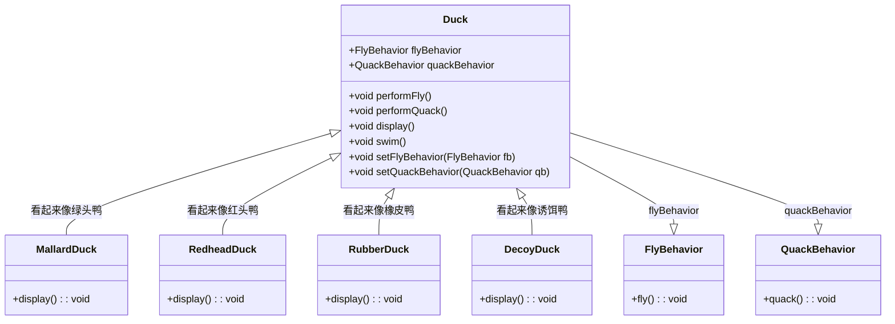

# 策略模式

>[!quote] 策略模式
>策略模式 定义了一系列算法，并将每一个算法封装起来，使它们可以在运行时互换使用
>
>- **优点**
>	- 易于扩展和维护：将算法封装在独立的类中，使得它们易于切换和扩展
>	- 独立性：算法的变化不会影响到使用算法的用户
>	- 需要增加算法时，不用修改，只需要添加即可
>- **缺点**
>	- 类爆炸：如果策略类太多，可能会导致系统难以管理和扩展

>[!hint] 策略模式中依赖了哪些 OO 原则 ？
> - 依赖倒置原则
> - 开放封闭原则
> - 单独封装变化
> - 组合复用原则

