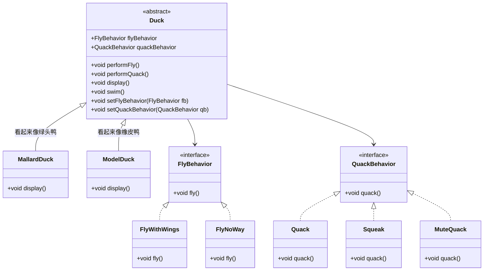

# 策略模式
>[!quote] 策略模式
>策略模式 定义了一系列算法，并将每一个算法封装起来，使它们可以在运行时互换使用
>
>- **优点**
>	- 易于扩展和维护：将算法封装在独立的类中，使得它们易于切换和扩展
>	- 独立性：算法的变化不会影响到使用算法的用户
>	- 需要增加算法时，不用修改，只需要添加即可
>- **缺点**
>	- 类爆炸：如果策略类太多，可能会导致系统难以管理和扩展

>[!hint] 策略模式中依赖了哪些 OO 原则 ？
> - 依赖倒置原则
> - 开放封闭原则
> - 单独封装变化
> - 组合复用原则

---

- **不使用策略模式**：Duck 类中写入 `fly()` ，和 `quack()` ，然后各种子类重写这两个方法，自己去实现
	- 缺点
		- 如果有些子类不会飞，也不会叫，那会在该类中重写方法，但是没有方法体，是一个空方法

- **使用策略模式**
Duck 的子类中变化的部分：<u>飞行</u>【~~有子类不会飞；有子类有多种飞行模式；有的子类被安装了人工翅膀~~】，<u>叫声</u>【~~有的子类不会叫~~】，不太会变的部分：<u>自我介绍</u>

