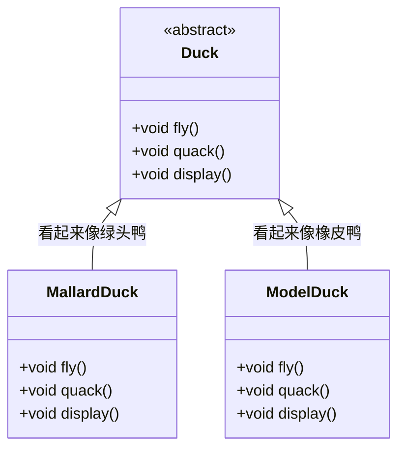
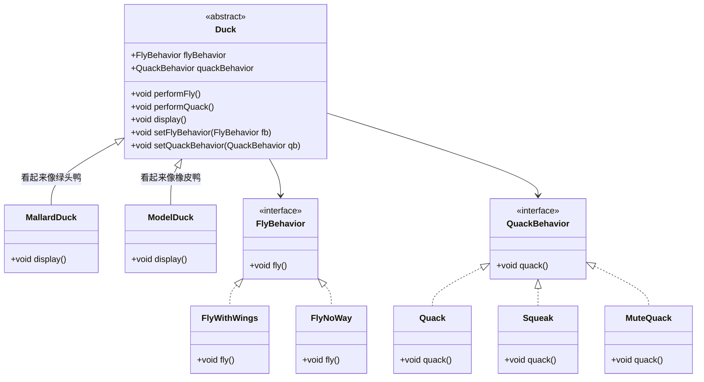

# ❤️ 责任链模式
> [!quote] 责任链模式
> 责任链模式 允许多个对象练成一条链，并沿着这条链传递请求，直到有一个对象处理它为止，使得每个对象都有机会处理请求，从而避免请求的发送者和接收者之间的耦合
> 

---

例子 ：有一个报销费用，要经过层层审批，如果金额过大，那审批的流程就会长一点

- 传递类
```java
// 报销申请类，层层传递下去的类
class Reimbursement {
    private int amount;

    public Reimbursement(int amount) { this.amount = amount; }
    public int getAmount() { return amount; }
}
```

- 责任链
```java
// 抽象的审批人
interface Approver {
    Approver setNextApprover(Approver nextApprover);
    void processRequest(Reimbursement reimbursement);
}
```

```java
// 抽象类定义重用方法
public abstract class AbstractApprover {
    private String name;
    private Approver nextApprover;

    @Override
    public Approver setNextApprover(Approver nextApprover){
		this.nextApprover = nextApprover;
        return this;
    }
    
    @Override
    abstract void processRequest(Reimbursement reimbursement);
}
```

```java
/*
具体审批人 - 部门经理
*/
public class DepartmentManager extends AbstractApprover {

    public DepartmentManager(String name) {
        this.name = name;
    }

    @Override
    public void processRequest(Reimbursement reimbursement) {
        if (reimbursement.getAmount() > 10000) {
            if (nextApprover != null) {
                nextApprover.processRequest(reimbursement);
            } else {
                System.out.println(" 没有更多审批人可用于金额请求 " + reimbursement.getAmount());
            }
        } else {
            System.out.println(name + " 已批准金额请求 " + reimbursement.getAmount());
        }
    }
}
```

```java
/*
具体审批人 - 财务经理
*/
public class FinanceManager extends AbstractApprover {

    public FinanceManager(String name) {
        this.name = name;
    }

    @Override
    public void processRequest(Reimbursement reimbursement) {
	    if (reimbursement.getAmont() > 20000) {
		    if (nextApprover != null) {
			    nextApprover.processRequest(reimbursement);
		    } else {
                System.out.println(" 没有更多审批人可用于金额请求 " + reimbursement.getAmount());
		    }
	    }
	    else {
	        System.out.println(name + " 已批准金额请求 " + reimbursement.getAmount());
	    }
    }
}
```

```java
/* 
具体审批人 - CEO
*/
public class CEO extends AbstractApprover {

    public CEO(String name) {
        this.name = name;
    }
    
    @Override
    public void processRequest(Reimbursement reimbursement) {
	    if (reimbursement.getAmont() > 30000) {
		    if (nextApprover != null) {
			    nextApprover.processRequest(reimbursement);
		    } else {
                System.out.println(" 没有更多审批人可用于金额请求 " + reimbursement.getAmount());
		    }
	    }
	    else {
	        System.out.println(name + " 已批准金额请求 " + reimbursement.getAmount());
	    }
    }
}
```

- 测试
```java
// 测试
public static void main(String[] args) {
	// 构建责任链
	Approver approver = new DepartmentManager("部门经理")
							.setNextApprover(new FinanceManager("财务经理"))
							.setNextApprover(new CEO("CEO"));

	approver.processRequest(new Reimbursement(60000));
}
```

# ❤️ 过滤器链模式
>[!quote] 过滤器链模式
>过滤器链模式 跟责任链模式很像，但是不会在节点上进行处理，而是会处理放行，或者拦截。也不会在节点上维护下一个节点，而是由专门的类来维护

- 抽象过滤器
```java
public interface Filter {
    List<Integer> filter(User user, List<Integer> prizes);
}
```

- 具体过滤器
```java
// 黑名单过滤器
public class BlacklistFilter implements Filter {

    @Override
    public List<Integer> filter(User user, List<Integer> prizes) {
        if (user.isBlacklisted()) {
            return Collections.singletonList(101);
        }
        return prizes;
    }
}
```

```java
// 抽奖次数过滤器
public class DrawCountFilter implements Filter {

    @Override
    public List<Integer> filter(User user, List<Integer> prizes) {
        if (user.getDrawCount() >= 50) {
            return List.of(106, 107, 108);
        } else if (user.getDrawCount() < 10) {
            return prizes.stream().filter(prize -> prize < 106).collect(Collectors.toList());
        }
        return prizes;
    }
}
```

- 过滤器链类
```java
public class FilterChain {
	// 维护一个过滤器链集合
    private final List<Filter> filters = new ArrayList<>();

    public FilterChain addFilter(Filter filter) {
        filters.add(filter);
        return this;
    }

    public List<Integer> execute(User user, List<Integer> prizes) {
        for (Filter filter : filters) {
            prizes = filter.filter(user, prizes);
        }
        return prizes;
    }
}
```

- 测试类
```java
psvm {
	List<Integer> prizes = Arrays.asList(100, 101, 102, 103, 104, 105, 106, 107, 108);
        
	List<Integer> filteredPrizes1 = new FilterChain()
		.addFilter(new BlacklistFilter())
		.addFilter(new DrawCountFilter())
		.execute(new User(), prizes);
}
```

# ❤️ 策略模式
>[!quote] 策略模式
>策略模式 定义了一系列算法，并将每一个算法封装起来，使它们可以在运行时互换使用【~~策略 -> 一组行为集合，算法 -> 行为~~】
>
>- **优点**
>	- 易于扩展和维护：将算法封装在独立的类中，使得它们易于切换和扩展，添加新的行为只需要添加一个新的算法类，而不需要修改现有的类层次结构
>	- 独立性：算法的变化不会影响到使用算法的用户
>	- 灵活：可以在运行时动态改变对象的行为，而不需要修改对象本身的代码
>	- 可复用：策略可以在不同的上下文中重用，只要上下文需要相同的行为。这增加了代码的复用性【~~比如有另外一个 bird 类也需要 fly 行为~~】
>- **缺点**
>	- 类爆炸：如果策略类太多，可能会导致系统难以管理和扩展

>[!hint] 策略模式中依赖了哪些 OO 原则 ？
> - 依赖倒置原则
> - 开放封闭原则
> - 单独封装变化
> - 组合复用原则

---

> **案例场景分析**：
> Duck 的子类中：
> - 变化的部分：飞行【~~有子类不会飞；有子类有多种飞行模式；有的子类被安装了人工翅膀~~】，叫声【~~有的子类不会叫~~】；
> - 不太会变的部分：`display()`

## 不使用策略模式
也就是直接使用继承实现行为，Duck 类中写入 `fly()` ， `quack()` ，然后各种子类重写这两个方法，自己去实现自己的行为

---

<u>缺点</u> ：
- 如果有些子类不会飞，也不会叫，那会在该类中重写方法，但是没有方法体，是一个空方法
- 如果后续要去掉一组行为，那将变动所有的类



## 使用策略模式


## 简单例子
- 定义支付策略接口
```java
public interface PaymentStrategy {
    void pay(int amount);
}
```

- 具体的策略接口
```java
public class AlipayPayment implements PaymentStrategy {
    @Override
    public void pay(int amount) {
        System.out.println("Paid " + amount + " using Alipay.");
    }
}

public class WeChatPayment implements PaymentStrategy {
    @Override
    public void pay(int amount) {
        System.out.println("Paid " + amount + " using WeChat.");
    }
}
```

- 上下文类
```java
public class ShoppingCart {
    private PaymentStrategy paymentStrategy;

    public void setPaymentStrategy(PaymentStrategy paymentStrategy) {
        this.paymentStrategy = paymentStrategy;
    }

    public void checkout(int amount) {
        paymentStrategy.pay(amount);
    }
}
```

- 测试
```java
public static void main(String[] args) {
	ShoppingCart cart = new ShoppingCart();

	// 使用支付宝支付
	cart.setPaymentStrategy(new AlipayPayment());
	cart.checkout(200);

	// 使用微信支付
	cart.setPaymentStrategy(new WeChatPayment());
	cart.checkout(300);
}
```

# ❤️ 模板模式
>[!quote] 模板模式
>模板模式 定义了一个算法的骨架，对于一些具体的实现步骤，交给子类去实现。<u>个人看法认为模板模式就是对于抽象类的运用</u>

我们要对淘宝，京东，当当的网站进行登录，爬取信息，组装海报，虽然每个网站是不一样的，但是步骤是一样的：

- 定义整体的步骤抽象类模板
```java
public abstract class NetMall {
    String uId;   // 用户ID
    String uPwd;  // 用户密码

    public NetMall(String uId, String uPwd) {
        this.uId = uId;
        this.uPwd = uPwd;
    }

    /**
     * 生成商品推广海报，大家都一样的方法，不定义为抽象
     */
    public String generateGoodsPoster(String skuUrl) {
	    // 1. 验证登录
        if (!login(uId, uPwd)) return null;     
        // 2. 爬虫商品
        Map<String, String> reptile = reptile(skuUrl); 
        // 3. 组装海报
        return createBase64(reptile);      
    }

    // 模拟登录
    protected abstract Boolean login(String uId, String uPwd);

    // 爬虫提取商品信息(登录后的优惠价格)
    protected abstract Map<String, String> reptile(String skuUrl);

    // 生成商品海报信息
    protected abstract String createBase64(Map<String, String> goodsInfo);
}
```

- 定义具体的类
```java
public class JDNetMall extends NetMall {
    public JDNetMall(String uId, String uPwd) {
        super(uId, uPwd);
    }

	/*
		实现具体的三个步骤
	*/
    public Boolean login(String uId, String uPwd) {
	    // …… 具体业务逻辑
        return true;
    }
    public Map<String, String> reptile(String skuUrl) {
	    // …… 具体业务逻辑
        return map;
    }
    public String createBase64(Map<String, String> goodsInfo) {
	    // …… 具体业务逻辑
        return ……;
    }
}
```

```java
public class TaoBaoNetMall extends NetMall {
    public TaoBaoNetMall(String uId, String uPwd) {
        super(uId, uPwd);
    }

    @Override
    public Boolean login(String uId, String uPwd) {……}
    @Override
    public Map<String, String> reptile(String skuUrl) {……}
    @Override
    public String createBase64(Map<String, String> goodsInfo) {……}
}
```

```java
public class DangDangNetMall extends NetMall {
    public DangDangNetMall(String uId, String uPwd) {
        super(uId, uPwd);
    }

    @Override
    public Boolean login(String uId, String uPwd) {……}

    @Override
    public Map<String, String> reptile(String skuUrl) {……}

    @Override
    public String createBase64(Map<String, String> goodsInfo) {……}
}
```

- 测试
```java
@Test
public void test_NetMall() {
	// 创建京东类
    NetMall netMall = new JDNetMall("1000001","*******");
    // 生成海报
    String base64 = netMall.generateGoodsPoster("jd.com/42.html");
    logger.info("测试结果：{}", base64);
}
```