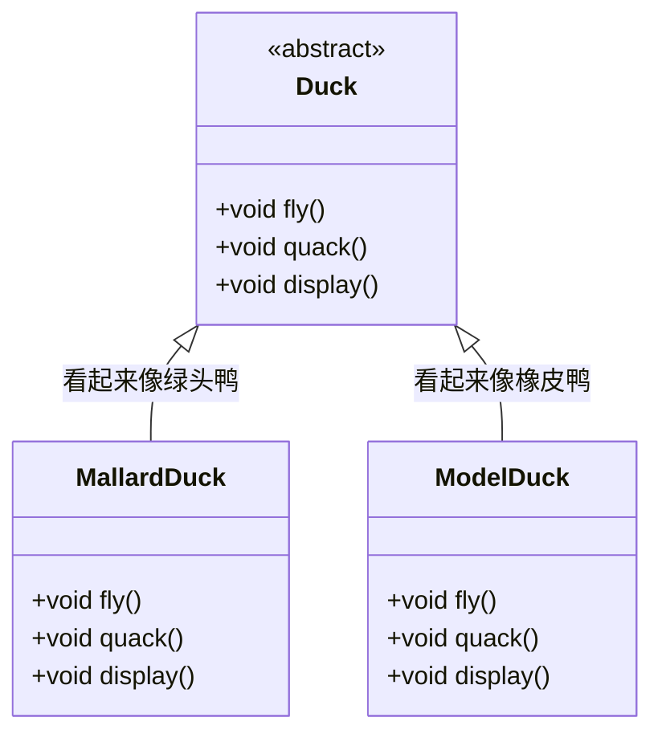
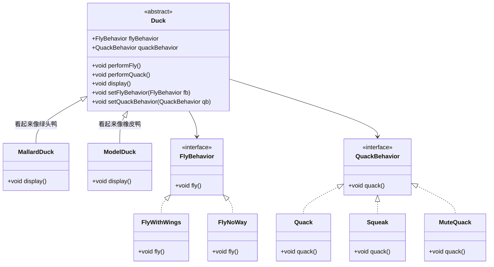

# 策略模式
>[!quote] 策略模式
>策略模式 定义了一系列算法，并将每一个算法封装起来，使它们可以在运行时互换使用【~~策略 -> 一组行为集合，算法 -> 行为~~】
>
>- **优点**
>	- 易于扩展和维护：将算法封装在独立的类中，使得它们易于切换和扩展
>	- 独立性：算法的变化不会影响到使用算法的用户
>	- 需要增加算法时，不用修改，只需要添加即可
>- **缺点**
>	- 类爆炸：如果策略类太多，可能会导致系统难以管理和扩展

>[!hint] 策略模式中依赖了哪些 OO 原则 ？
> - 依赖倒置原则
> - 开放封闭原则
> - 单独封装变化
> - 组合复用原则

---

- **不使用策略模式**：<u>也就是使用继承</u>，Duck 类中写入 `fly()` ，和 `quack()` ，然后各种子类重写这两个方法，自己去实现
	- 缺点
		- 如果有些子类不会飞，也不会叫，那会在该类中重写方法，但是没有方法体，是一个空方法

- **使用策略模式**
Duck 的子类中变化的部分：<u>飞行</u>【~~有子类不会飞；有子类有多种飞行模式；有的子类被安装了人工翅膀~~】，<u>叫声</u>【~~有的子类不会叫~~】，不太会变的部分：<u>自我介绍</u>

1. **解耦**：策略模式允许将算法与使用算法的上下文分离，从而降低了类之间的耦合度。这意味着改变策略不会影响使用这些策略的类
2. **可扩展性**：在策略模式中，添加新的行为只需要添加一个新的策略类，而不需要修改现有的类层次结构。这使得系统更容易扩展
3. **灵活性**：策略模式提供了更高的灵活性，因为可以在运行时动态地改变对象的行为，而不需要修改对象本身的代码
4. **避免多重继承问题**：Java不支持多重继承，这意味着一个类不能同时继承多个父类。使用策略模式可以避免这个问题，因为每个策略都是独立的类
8. **可复用**：策略可以在不同的上下文中重用，只要上下文需要相同的行为。这增加了代码的复用性【~~比如有一个 bird 类也需要 fly 行为~~】
    

举个例子，假设我们有一个`Duck`类，它需要有不同的行为，比如`fly()`和`quack()`。使用继承，我们可能会创建多个子类，每个子类实现不同的行为。使用策略模式，我们可以定义`FlyBehavior`和`QuackBehavior`接口，然后创建多个实现这些接口的类。`Duck`类可以组合这些行为，并且可以在运行时根据需要改变它们。

在这个例子中，`Duck`类的行为是通过组合策略对象来实现的，而不是通过继承。这意味着我们可以灵活地为`Duck`对象设置不同的飞行和叫声行为，而不需要创建大量的子类。

