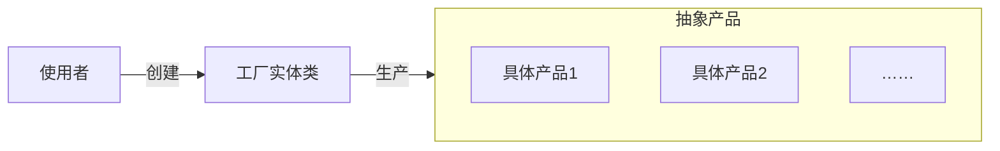
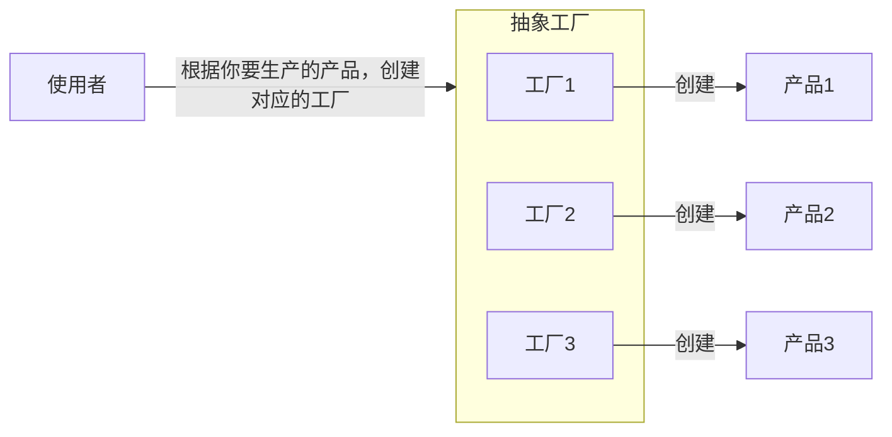
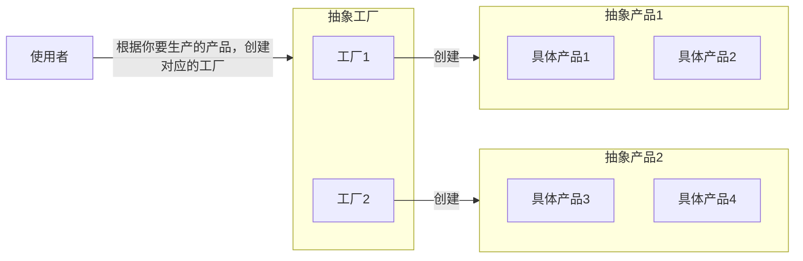

>[!hint] 设计模式可以让改代码，维护代码更加简单

- 工厂方法
- 抽象工厂
- 生成器
- 原型
- 单例

# 工厂模式
- **未使用工厂模式**，~~使用 if … else … 结构~~
```java
public class Circle {
    public void Draw() { sout("Drawing a Circle"); }
}

public class Rectangle {
    public void Draw() { sout("Drawing a Rectangle"); }
}

public class Client {
    public void DrawShape(string shapeType) {
        if (shapeType == "Circle") {
            Circle circle = new Circle();
            circle.Draw();
        } else if (shapeType == "Rectangle") {
            Rectangle rectangle = new Rectangle();
            rectangle.Draw();
        } else {
            throw new ArgumentException("Invalid shape type");
        }
    }
}

// 使用
psvm {
	Client client = new Client();
	client.DrawShape("Circle");
	client.DrawShape("Rectangle");
}
```

## 简单工厂模式


```java
// 抽象产品
public interface IShape { void Draw(); }

// 具体产品类
public class Circle {
    public void Draw() { sout("Drawing a Circle"); }
}

public class Rectangle {
    public void Draw() { sout("Drawing a Rectangle"); }
}

// 工厂类
@Components
public class ShapeFactory {
	// 维护了一个map集合，代替了if……else……
    private Map<String, IShape> shapeMap = new HashMap<>();

    public ShapeFactory() {
        shapeMap.put("Circle", new Circle());
        shapeMap.put("Rectangle", new Rectangle());
    }

    public IShape CreateShape(String shapeType) {
        IShape shape = shapeMap.get(shapeType);
        if (shape == null) {
            throw new IllegalArgumentException("Invalid shape type");
        }
        return shape;
    }
}

// 客户端代码
public class Client {
	@Autowired
    private ShapeFactory shapeFactory;

    public void DrawShape(string shapeType) {
        IShape shape = shapeFactory.CreateShape(shapeType);
        shape.Draw();
    }
}

// 使用
Client client = new Client();
client.DrawShape("Circle");
client.DrawShape("Rectangle");
```

## 工厂方法模式


```java
// 抽象产品
public interface IShape { void Draw(); }

// 具体产品类
public class Circle implements IShape {
    public void Draw() { sout("Drawing a Circle"); }
}

public class Rectangle implements IShape {
    public void Draw() { sout("Drawing a Rectangle"); }
}

// 抽象工厂
public abstract class ShapeFactory {
    public abstract Shape createShape();
}

// 具体工厂
public class CircleFactory extends ShapeFactory {
    @Override
    public Shape createShape() { return new Circle(); }
}

public class RectangleFactory extends ShapeFactory {
    @Override
    public Shape createShape() { return new Rectangle(); }
}

// 客户端代码
public class Client {
    public void DrawShape(ShapeFactory shapeFactory) {
        IShape shape = shapeFactory.createShape();
        shape.Draw();
    }
}

// 使用
Client client1 = new Client();

client1.DrawShape(new CircleFactory());
client2.DrawShape(new RectangleFactory());
```

## 抽象工厂模式


```java
// 抽象产品：形状接口
interface Shape {
    void draw();
}

// 具体产品：圆形
class Circle implements Shape {
    public void draw() {
        System.out.println("Inside Circle::draw() method.");
    }
}

// 具体产品：矩形
class Rectangle implements Shape {
    public void draw() {
        System.out.println("Inside Rectangle::draw() method.");
    }
}

// 抽象工厂：形状工厂接口
interface ShapeFactory {
    Shape getShape();
}

// 具体工厂：圆形工厂
class CircleFactory implements ShapeFactory {
    public Shape getShape() {
        return new Circle();
    }
}

// 具体工厂：矩形工厂
class RectangleFactory implements ShapeFactory {
    public Shape getShape() {
        return new Rectangle();
    }
}

// 客户端代码
public class FactoryPatternDemo {
    public static void main(String[] args) {
	    // 创建抽象工厂
        ShapeFactory shapeFactory = null;

        // 使用圆形工厂
        shapeFactory = new CircleFactory();
        Shape shape1 = shapeFactory.getShape();
        shape1.draw();

        // 使用矩形工厂
        shapeFactory = new RectangleFactory();
        Shape shape2 = shapeFactory.getShape();
        shape2.draw();
    }
}
```


