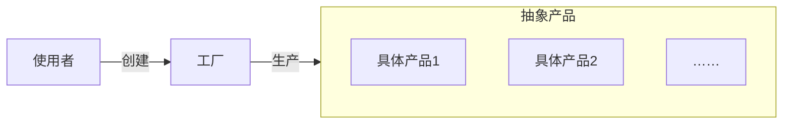

>[!hint] 设计模式可以让改代码，维护代码更加简单

- 工厂方法
- 抽象工厂
- 生成器
- 原型
- 单例

# 工厂方法模式


- **未使用工厂模式**，~~使用 if … else … 结构~~
```java
public class Circle {
    public void Draw() { sout("Drawing a Circle"); }
}

public class Rectangle {
    public void Draw() { sout("Drawing a Rectangle"); }
}

public class Client {
    public void DrawShape(string shapeType) {
        if (shapeType == "Circle") {
            Circle circle = new Circle();
            circle.Draw();
        } else if (shapeType == "Rectangle") {
            Rectangle rectangle = new Rectangle();
            rectangle.Draw();
        } else {
            throw new ArgumentException("Invalid shape type");
        }
    }
}

// 使用
psvm {
	Client client = new Client();
	client.DrawShape("Circle");
	client.DrawShape("Rectangle");
}
```

 - **使用工厂模式**
```java
// 抽象产品
public interface IShape { void Draw(); }

// 具体产品类
public class Circle {
    public void Draw() { sout("Drawing a Circle"); }
}

public class Rectangle {
    public void Draw() { sout("Drawing a Rectangle"); }
}

// 工厂类
public class ShapeFactory {
	// 维护了一个map集合，代替了if……else……
    private Map<String, IShape> shapeMap = new HashMap<>();

    public ShapeFactory() {
        shapeMap.put("Circle", new Circle());
        shapeMap.put("Rectangle", new Rectangle());
    }

    public IShape CreateShape(String shapeType) {
        IShape shape = shapeMap.get(shapeType);
        if (shape == null) {
            throw new IllegalArgumentException("Invalid shape type");
        }
        return shape;
    }
}

// 客户端代码
public class Client {
	@Autowired
    private ShapeFactory shapeFactory;

    public void DrawShape(string shapeType) {
        IShape shape = shapeFactory.CreateShape(shapeType);
        shape.Draw();
    }
}

// 使用
Client client = new Client();
client.DrawShape("Circle");
client.DrawShape("Rectangle");
```

# 抽象工厂模式


