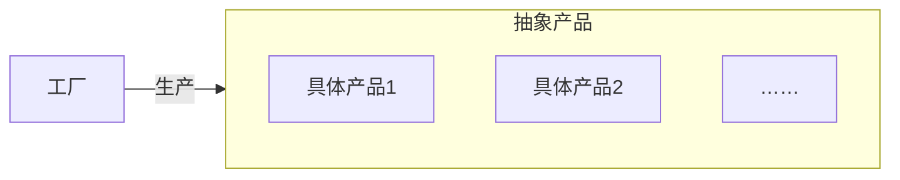

>[!hint] 设计模式可以让改代码，维护代码更加简单

- 工厂方法
- 抽象工厂
- 生成器
- 原型
- 单例

# 工厂模式



```java
public class Circle {
    public void Draw() {
        sout("Drawing a Circle");
    }
}

public class Rectangle {
    public void Draw() {
        sout("Drawing a Rectangle");
    }
}

public class Client {
    public void DrawShape(string shapeType) {
        if (shapeType == "Circle") {
            Circle circle = new Circle();
            circle.Draw();
        } else if (shapeType == "Rectangle") {
            Rectangle rectangle = new Rectangle();
            rectangle.Draw();
        } else {
            throw new ArgumentException("Invalid shape type");
        }
    }
}

// 使用
psvm {
	Client client = new Client();
	client.DrawShape("Circle");
	client.DrawShape("Rectangle");
}
```

```java
// 抽象产品
public interface IShape { void Draw(); }

// 具体产品类
public class Circle implements IShape {
    public void Draw() {
        sout("Drawing a Circle");
    }
}

public class Rectangle implements IShape {
    public void Draw() {
        sout("Drawing a Rectangle");
    }
}

// 工厂类
public class ShapeFactory {
    public IShape CreateShape(string shapeType) {
        if (shapeType == "Circle") {
            return new Circle();
        } else if (shapeType == "Rectangle") {
            return new Rectangle();
        } else {
            throw new ArgumentException("Invalid shape type");
        }
    }
}

// 客户端代码
public class Client {
	@Autowired
    private ShapeFactory shapeFactory;

    public void DrawShape(string shapeType) {
        IShape shape = shapeFactory.CreateShape(shapeType);
        shape.Draw();
    }
}

// 使用
Client client = new Client();
client.DrawShape("Circle");
client.DrawShape("Rectangle");
```

---

```java
@Component
public class ShapeFactory {
    private Map<String, IShape> shapeMap;

    @Autowired
    private List<IShape> shapes;

    @PostConstruct
    public void init() {
        shapeMap = shapes.stream()
                         .collect(Collectors.toMap(shape -> shape.getClass().getSimpleName(), shape -> shape));
    }

    public IShape CreateShape(String shapeType) {
        IShape shape = shapeMap.get(shapeType);
        if (shape == null) {
            throw new IllegalArgumentException("Invalid shape type");
        }
        return shape;
    }
}
```


