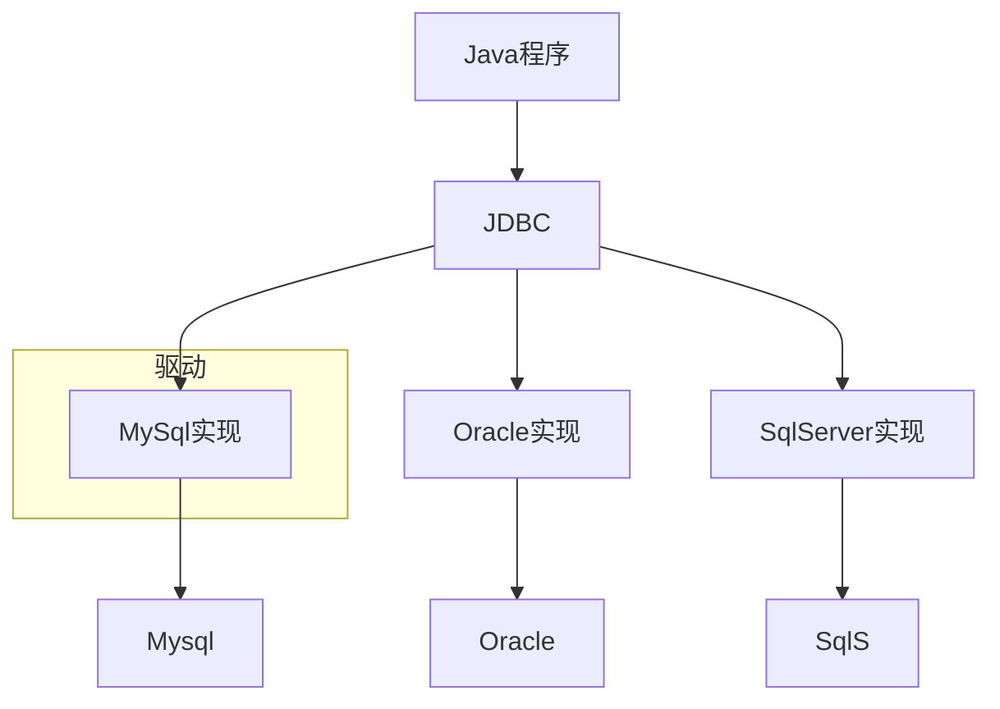

---
tags:
  - 计算机/数据库
---
# 🌕准备工作
- 引入MyBatis的相关依赖

- 配置MyBatis

- 配置SQL提示
	
	- 在idea的数据库配置中添加数据库
	
	


MyBatis是一个开源的Java持久层框架，它提供了一种优雅的方式来进行数据库访问。MyBatis的主要目标是简化数据库访问代码的编写，提供灵活性和高度可定制的SQL映射，以及良好的性能。




```mermaid

```

