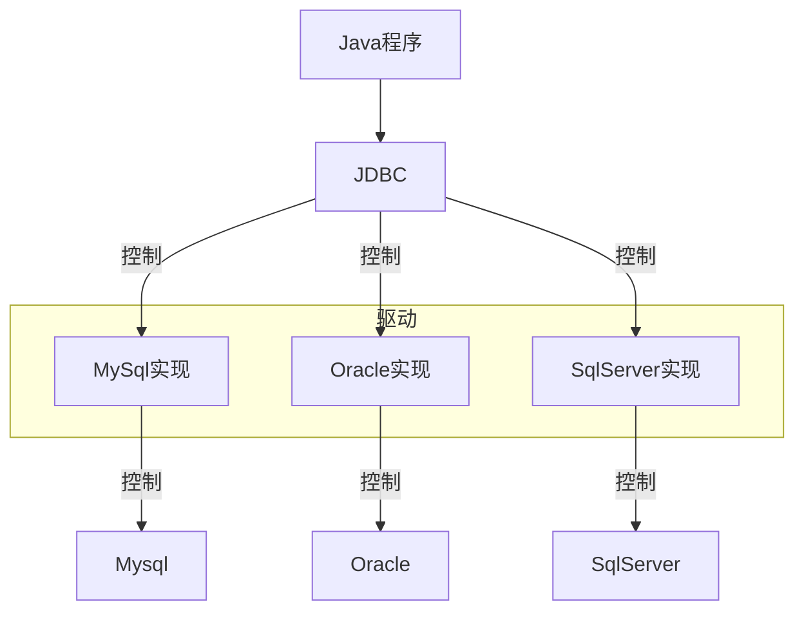

---
tags:
  - 计算机/数据库
---
# 🌕基本概念
>MyBatis是一个开源的Java持久层框架，***封装了JDBC程序***，提供了一种优雅的方式来进行数据库访问，简化了数据库访问代码的编写，提供了灵活性和高度可定制的SQL映射，以及良好的性能

>JDBC是SUN公司提供的一套操作关系型数据库的API

# 🌕准备工作
- 引入MyBatis的相关依赖

- 配置MyBatis

- 配置SQL提示
	
	- 在idea的数据库配置中添加数据库
	
	

