---
tags:
  - 计算机/数据库
---
# 🌕基本概念
### 🌗什么是MyBatis
>MyBatis是一个开源的Java持久层框架，***封装了JDBC程序***，提供了一种优雅的方式来进行数据库访问，简化了数据库访问代码的编写，提供了灵活性和高度可定制的SQL映射，以及良好的性能

>JDBC是SUN公司提供的一套操作关系型数据库的API

```mermaid
graph TB
	a[Java程序]-->b[JDBC]
	b--控制-->c[MySql实现]
	b--控制-->d[Oracle实现]
	b--控制-->e[SqlServer实现]

	c--控制-->f[Mysql]
	d--控制-->g[Oracle]
	e--控制-->h[SqlServer]

    subgraph 驱动
    c
    d
    e
    end
```
### 🌗数据库连接池技术
- 在没有数据库连接池技术时，Java程序要执行一条SQL语句，就要创建一个数据库连接对象，在使用完成之后，再释放这个连接对象
- 而使用了数据库连接池技术后，客户端需要执行SQL语句时，可以去数据库连接池中拿连接对象，用完之后再还回去

```mermaid
graph LR
	a[客户端A]--拿Connection对象-->b[数据库连接池]
	b--还回去-->a
	
	c[客户端B]-->b
	
	d[客户端C]-->b

	b--访问-->e[数据库]
```


>[!hint] 数据库连接池的优点
>- 资源的重用【用完的Connection对象无需销毁，还回去即可】
>- 提升系统的响应速度【无需创建Connection对象，去拿即可】


# 🌕准备工作
- 引入MyBatis的相关依赖

- 配置MyBatis

- 配置SQL提示
	
	- 在idea的数据库配置中添加数据库
	
	


